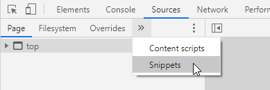
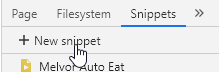
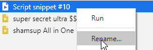
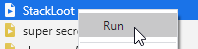

# shamsup's Melvor Idle Scripts

This is a collection of scripts/snippets for the game
[Melvor Idle](https://melvoridle.com), a browser-based idle game based on the
popular MMORPG Runescape.

compatible with v0.16.3 Alpha of Melvor Idle.

---

## How do I use these?

### Chrome

- <kbd>f12</kbd> to bring up the developer tools
- Select the "Sources" tab at the top
- In the `>>` menu, select "Snippets" (might be visible already)  
  
- Click `+New snippet`  
  
- paste the code from the desired script into the code window
- save the snippet <kbd>ctrl+s</kbd>/<kbd>cmd+s</kbd>
- Right click the snippet and rename it to something descriptive  
  
- Right click the snippet and run it!  
  
- It's now running!
- _you will have to `run` the snippet each time to reload the window_ although an
extension like Tampermonkey can automatically run scripts for you.


### Firefox

_TODO_

---

## What do these even do?

There are multiple scripts that may or may not be considered useful by most
players:

- [Auto Eat](#auto-eat)
- [Auto Loot](#auto-loot)
- [Loot Stacking](#loot-stacking)
- [XP Tracker](#xp-tracker)
- [Sticky Header](#sticky-header)

---

## Auto Eat

[AutoEat.js](./AutoEat.js)

This script will automatically eat if your health goes below the amount of
health an enemy could hit you for in a single attack. It will try to delay
eating until after your next attack to avoid the dps loss from resetting the
swing timer (a simple flag can be passed into the eatFood function in order to
skip resetting the timer regardless, but I don't feel that it's in the spirit of
the game to include it by default).

If you would like to cancel the effect, you can reload the page or type the
following in the console:

```javascript
clearTimeout(shamsup_autoEatTimer);
```
_note: there is a bug currently regarding channeled effects where it will eat
based on the total damage of the dot, instead of only the damage that can occur
before the next eating interval._

---

## Auto Loot

[AutoLoot.js](./AutoLoot.js)

This script will check for loot every few seconds and pick it up so that no loot
is lost while idling. It is still possible to fill up the loot window if the
bank is full, although the [Loot Stacking]() script can help to avoid this
problem.

In order to cancel the effect, you can reload the page or type the following in
the console:

```javascript
clearInterval(shamsup_autoLootTimer);
```

---

## Loot Stacking

[StackLoot.js](./StackLoot.js)

In the base game, bones (and bone variants) are the only items that will stack
together in the loot window. This script gives a nice quality of life boost if
you like to watch the loot all pile up over the course of a few kills (or few
thousand kills) by combining stacks of the same item into a single stack every
few seconds.

In order to cancel the effect, you can reload the page or type the following in
the console:

```javascript
clearInterval(shamsup_stackLootTimer);
```

_note: this is not guaranteed to prevent items from being lost due to a full
loot window. Before using, make sure that the enemy has less than 16 unique
drops including bones._

---

## XP Tracker

[XPTracker.js](./XPTracker.js)

This will add a very complete XP tracking window to the top bar of the game (bar
graph icon). Every few seconds, any experience gains will be recorded and
displayed in a nice looking table. It tracks gains over the entire session, and
by default has separate views for 6-hour and 1-hour tracking windows.

To customize the tracking windows, edit the following line in
[XPTracker.js](./XPTracker.js):

```javascript
const TRACKING_TIME_MINUTES = [60, 60 * 6]
```

The values in the array are the window lengths in minutes that you'd like to
track (`60` = 1 hour).

In order to turn off the tracker, you can reload the window or type the
following in the console:

```javascript
clearInterval(shamsup_xpTrackingTimer);
```

---

## Sticky Header

[StickyHeader.js](StickyHeader.js)

This is a small quality of life upgrade that makes the top bar always visible,
no matter how far down you need to scroll. This is especially useful on narrower
screens when the sidebar is collapsed by default.

If you don't like the effect, you will need to reload the page to turn it off.